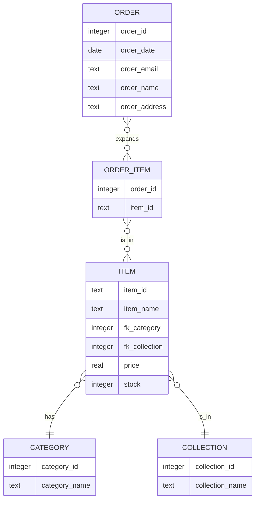

# faergria.shop

## Datenbankmodell

## Business Case für einen Merchandise-Onlineshop

### 1. Executive Summary

Der vorliegende Business Case beschreibt die Gründung und den Betrieb eines Onlineshops für Merchandise-Artikel, der
sich auf den spezialisierten Nischenmarkt der Community einer Kampagne eines Tabletop-RPGs (TTRPG) fokussiert.
Durch einzigartige Produkte, eine starke Online-Präsenz und ausgezeichnete Kundenerfahrungen zielt dieses
Geschäft darauf ab, eine treue Kundenbasis aufzubauen, beziehungsweise die Community zu stärken und eine führende
Position im Segment des Merchandise-Handels zu erlangen.

### 2. Marktanalyse

Marktbedarf: Die Popularität von Indie-Videospielen, Comics und Kultfilmen wächst stetig. Gerade Tabletop-RPGs, wie
Dungeons & Dragons gewinnen stetig an Communitywachstum. Fans suchen nach Wegen, ihre Leidenschaft durch den Kauf von
Merchandise-Artikeln auszudrücken.
Zielgruppenanalyse: Die primäre Zielgruppe besteht aus 18- bis 35-Jährigen Fans der Kampagne, die aktive Nutzer
sozialer Medien sind und Wert auf Originalität und Qualität legen.

### 3. Wettbewerbsanalyse

Direkte Konkurrenz: Es gibt bereits etablierte Merchandise-Shops; auch von anderen TTRPG-Kampagnen. Allerdings fehlt es
vielen an Nischensortimenten und personalisiertem Kundenservice.
Marktlücke: Dieser Onlineshop wird sich durch limitierte Editionen, Kollaborationen mit dem kreativen Kopf und
Spielleiter der Kampagne, sowie durch exklusive Produkte differenzieren.

### 4. Geschäftsmodell

Einkommensquellen: Haupteinnahmequelle sind der Direktverkauf von Waren. Zusätzliche Einkommen generieren wir durch
Dropshipping, Sondereditionen und Mitgliedschaften.
Preisstrategie: Die Preisgestaltung basiert auf einem Premium-Modell, das die Einzigartigkeit und Exklusivität der
Produkte widerspiegelt.

### 5. Betriebsplan

Lieferkette: Partnerschaften mit lokalen Herstellern und Künstlern, um die Produktion von qualitativ hochwertigen und
einzigartigen Merchandise-Artikeln zu gewährleisten.
Technologie: Einsatz einer skalierbaren E-Commerce-Plattform, die ein herausragendes Shopping-Erlebnis bietet, sowie
Implementierung modernster Zahlungs- und Sicherheitstechnologien.

### 6. Marketing- und Vertriebsstrategie

Online-Marketing: Schwerpunkt auf Social-Media-Marketing, Influencer-Partnerschaften und SEO, um eine starke
Online-Präsenz aufzubauen.
Kundenbindung: Einführung eines Belohnungssystems und eines Abonnementmodells für wiederkehrende Kunden.

### 7. Finanzieller Plan

Startkapitalbedarf: Geschätzt auf 100.000 Euro für Anfangsinventar, Webseitenentwicklung, Marketing und Betriebskapital.
Umsatzprognose: Erwartung eines Break-Even-Punktes innerhalb der ersten 18 Monate mit einer stetigen Umsatzsteigerung,
basierend auf Marktanalysen und vorläufigen Bestellungen.

### 8. Risikobewertung

Marktrisiken: Schnelllebige Trends können die Nachfrage beeinflussen. Risikominderung durch flexible Inventarverwaltung
und ständige Marktbeobachtung.
Betriebsrisiken: Potenzielle Herausforderungen in der Lieferkette könnten zu Verzögerungen führen. Durch
Diversifizierung der Lieferanten und Aufbau von Sicherheitsbeständen kann dem entgegengewirkt werden.

### 9. Rechtliche Überlegungen

Datenschutz und Compliance: Einhaltung aller relevanten E-Commerce-Gesetze, Datenschutzbestimmungen und Steuerpflichten.

### 10. Schlussfolgerung

Der Merchandise-Onlineshop bietet eine vielversprechende Geschäftsmöglichkeit, die auf umfangreichen Marktanalysen und
einer klaren Differenzierungsstrategie basiert. Durch die Konzentration auf Nischenmärkte, die Partnerschaft mit
Indie-Entwicklern und Künstlern sowie durch den Aufbau einer