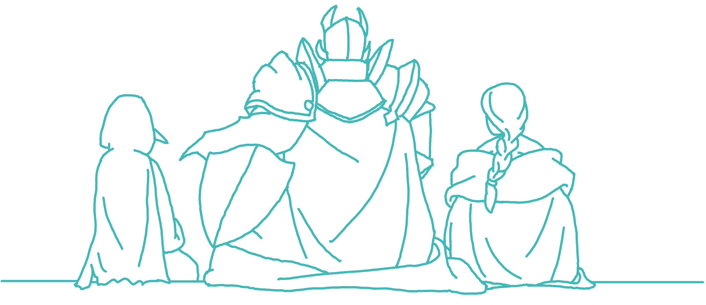
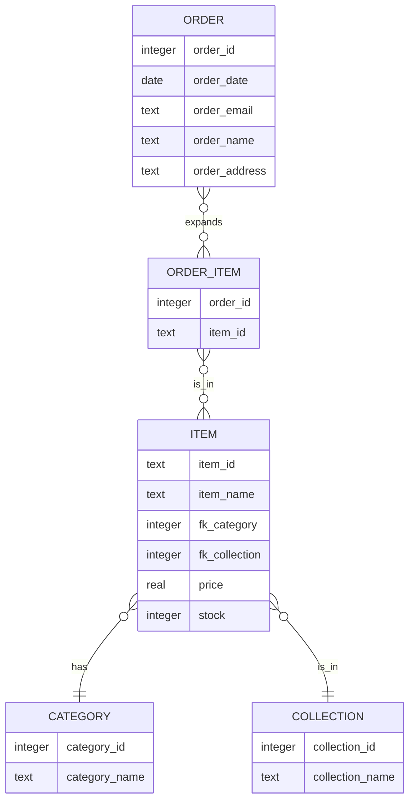

<p align="center"><br><br></p>

<h2 align="center">Faergria Webshop</h2>
<p align="center"><strong><code>faergriaWebshop</code></strong></p>
<p align="center">Ein Mock-Up Webshop für Fanartikel einer Dungeons & Dragons Kampagne</p>
<br>
<p align="center">
  
</p>

<h2>Table of Contents</h3>

<!-- TOC -->
  * [1. Einleitung](#1-einleitung)
  * [2. Mitwirkende](#2-mitwirkende)
  * [3. Userguide](#3-userguide)
    * [a. Installation](#a-installation)
    * [b. Ausführen der Applikation](#b-ausführen-der-applikation)
    * [c. Nutzung der interaktiven Karte](#c-nutzung-der-interaktiven-karte)
  * [4. Dokumentation](#4-dokumentation)
    * [a. Verwendete Technologien](#a-verwendete-technologien)
      * [i. Frontend-Entwicklung](#i-frontend-entwicklung)
      * [ii. Backend-Entwicklung](#ii-backend-entwicklung)
      * [iii. Datenbank](#iii-datenbank)
    * [b. Architektur](#b-architektur)
      * [i. Single Page Application (SPA)](#i-single-page-application-spa)
      * [ii. Vue.js und Reaktivität](#ii-vuejs-und-reaktivität)
      * [iii. Backend und Datenbank](#iii-backend-und-datenbank)
      * [iv. API und Event Handling](#iv-api-und-event-handling)
    * [c. Datenbankmodell](#c-datenbankmodell)
  * [5. Business Case](#5-business-case)
    * [a. Executive Summary](#a-executive-summary)
    * [b. Marktanalyse](#b-marktanalyse)
    * [c. Wettbewerbsanalyse](#c-wettbewerbsanalyse)
    * [d. Geschäftsmodell](#d-geschäftsmodell)
    * [e. Marketing- und Vertriebsstrategie](#e-marketing--und-vertriebsstrategie)
<!-- TOC -->

## 1. Einleitung

<p style="text-align: justify">
Die Website stellt einen Webshop mit Fanartikeln für eine Dungeons & Dragons Kampagne dar. Fans der Kampagne sollen
Artikel basierend auf der Kampagne anschauen, in den Warenkorb legen und schließlich bestellen können, um eine Bindung
mit der Kampagne herzustellen.
</p>

## 2. Mitwirkende

| Mitwirkende              | GitHub                                                                                                                                                                                 |
|--------------------------|----------------------------------------------------------------------------------------------------------------------------------------------------------------------------------------|
| Luke Grasser<br/>(Zetsu) | <a href="https://github.com/zetsuboushii"><br/>[@Zetsuboushii](https://github.com/zetsuboushii) |

## 3. Userguide

Im Folgenden wird das grundlegende Setup, sowie die Bedienelemente der Anwendung erklärt.

### a. Installation

_Zum Ausführen wird Node.js mit npm benötigt._

Zu Beginn das Projekt klonen und folgende Befehle ausführen:

```bash
npm install
```

### b. Ausführen der Applikation

```bash
npm run start
```

_Der Webshop ist während begrenzten Zeitrahmen unter http://faergriashop.zetsuboushii.site erreichbar._

### c. Nutzung der interaktiven Karte

Beim Aufruf der Website wird der Nutzer direkt auf der Homepage begrüßt. Die Navigation des Shops ist intuitiv
gestaltet:
<br>
Über die Navigationsleiste auf der linken Seite kann man zwischen den Subpages navigieren. Die Artikel-Karten verraten
den Namen, die Produktserie, das Aussehen und den Lagerbestand. Mit einem Klick auf `Add to Cart` wird der jeweilige
Artikel zum Warenkorb hinzugefügt.
<br>
Mit den beiden Buttons auf der rechten Seite lassen sich der Warenkorb ausklappen, und zum Anfang der Seite
zurückspringen.
<br>
Im Warenkorb lassen sich die Quantitäten der jeweiligen Artikel anpassen oder den Artikel entfernen.
<br>
Beim Check-Out kann daer Nutzer mit einem finalen Blick seine Bestellung überprüfen, seine Daten eingeben und die
Bestellung aufgeben.

## 4. Dokumentation

Im Folgenden wird das Projekt aus technischer Sicht näher beleuchtet.

### a. Verwendete Technologien

<p style="text-align: justify">
Dieses Webprojekt wurde mit einer Vielzahl moderner Technologien realisiert, um eine leistungsfähige und
benutzerfreundliche Anwendung zu erstellen. Im Folgenden werden die verwendeten Technologien ausführlicher beschrieben:
</p>

#### i. Frontend-Entwicklung

**Vue.js mit TypeScript**
<p style="text-align: justify">
Für das Frontend wurde das client-side Framework Vue.js verwendet, welches bekannt für seine Reaktivität und Modularität
ist. Die Entscheidung, Vue.js mit TypeScript zu kombinieren, ermöglicht es, die Vorteile von Typüberprüfung und modernen
JavaScript-Funktionen zu nutzen, was zu einer stabileren und wartbareren Codebasis führt. TypeScript bietet zudem eine
verbesserte Entwicklererfahrung durch besseren Code-Editor-Support und frühzeitige Fehlererkennung.
</p>

**Vuetify**
<p style="text-align: justify">
Um die Benutzeroberfläche zu gestalten und konsistente, ästhetisch ansprechende Komponenten zu verwenden, wurde das
Component Framework Vuetify integriert. Vuetify basiert auf Material Design Richtlinien und bietet eine breite Palette
an vorgefertigten UI-Komponenten, die leicht anzupassen sind. Dies beschleunigt die Entwicklung und gewährleistet eine
einheitliche Benutzererfahrung.
</p>

#### ii. Backend-Entwicklung

**ExpressJS**
<p style="text-align: justify">
Der Server wird mit ExpressJS realisiert, einem minimalen und flexiblen Node.js-Web-Application-Framework, das robuste
Features für Web- und Mobilanwendungen bietet. ExpressJS dient als Middleware-Schicht, die Anfragen verarbeitet, Routing
durchführt und als Kommunikationsbrücke zwischen dem Frontend und der Datenbank fungiert.
</p>

#### iii. Datenbank

**SQLite**
<p style="text-align: justify">
Die Datenhaltung wird durch eine SQLite-Datenbank gelöst. SQLite ist eine leichtgewichtige, dateibasierte Datenbank, die
sich besonders gut für lokale Anwendungen eignet. Sie benötigt keinen separaten Server und ist einfach zu konfigurieren
und zu verwalten. SQLite bietet dennoch ausreichende Leistungsfähigkeit und Funktionalität für viele Anwendungsfälle,
insbesondere für kleinere bis mittelgroße Projekte.
</p>

### b. Architektur

<p style="text-align: justify">
Für dieses Projekt wurde die Entscheidung getroffen, eine Single Page Application (SPA) zu entwickeln. Der Hauptgrund
hierfür ist die einzige statische Ansicht des Websops, in den dynamisch Elemente ein- und ausgeblendet werden können.
Eine SPA bietet mehrere Vorteile, insbesondere im Hinblick auf Leistung und Benutzererfahrung. Durch das Laden aller
erforderlichen Ressourcen auf einmal und das anschließende dynamische Aktualisieren des Inhalts wird die Notwendigkeit
ständiger Seitenneuladungen eliminiert, was zu einer schnelleren und flüssigeren Interaktion führt.
</p>

#### i. Single Page Application (SPA)

<p style="text-align: justify">
Eine SPA lädt initial eine HTML-Seite und aktualisiert den Inhalt dynamisch durch JavaScript, ohne die Seite neu zu
laden. Dies ermöglicht eine reibungslose und responsive Benutzererfahrung, da nur die notwendigen Teile der Seite
aktualisiert werden, anstatt den gesamten Inhalt neu zu laden. Dadurch werden die Serverlast und die Ladezeiten
reduziert, was zu einer verbesserten Performance führt.
</p>

#### ii. Vue.js und Reaktivität

<p style="text-align: justify">
Vue.js wurde als Framework gewählt, da es eine kleinteilige Komponentenstruktur ermöglicht. Diese Struktur erlaubt es,
Frontendelemente in separate, wiederverwendbare Komponenten auszulagern. Zu den Hauptkomponenten gehören:
</p>

- **Main**: Die Hauptansicht, in der die Subpages und andere dynamische Vue-Komponenten gerendert werden.
- **Cart**: Eine seitlich ein- und ausfahrbare Komponente, die die Artikel im Warenkorb anzeigt und Bearbeitung der
  Stückzahlen ermöglicht.
- **ItemGrid**: Eine Komponente, in der `ItemCard`-Komponenten in einem Gitter gerendert werden.

<p style="text-align: justify">
Vue.js ist bekannt für seine Reaktivität. Wenn sich der Zustand der Anwendung ändert, aktualisiert Vue automatisch die
betroffenen Teile der Benutzeroberfläche. Dies macht die Entwicklung effizienter und die Anwendung reaktionsschneller.
Reaktive Datenbindungen sorgen dafür, dass Änderungen im Datenmodell sofort im UI reflektiert werden, ohne dass explizit
DOM-Manipulationen durchgeführt werden müssen.
</p>

#### iii. Backend und Datenbank

<p style="text-align: justify">
Die Datenbank, in der unter anderem Informationen über Marker gespeichert werden, wird von einem Server gehostet und auf
einem spezifischen Port bereitgestellt. Die Datenbank verwendet SQLite, eine leichtgewichtige, dateibasierte
Datenbanklösung. Der Zugriff auf die Datenbank erfolgt über eine eigens entwickelte API. Diese API stellt dem Frontend
Funktionen und Variablen zur Verfügung, um Daten aus der Datenbank abzurufen und zu verwenden. Dies ermöglicht eine
klare Trennung zwischen Frontend und Backend, wodurch die Wartbarkeit und Skalierbarkeit der Anwendung verbessert wird.
</p>

#### iv. API und Event Handling

<p style="text-align: justify">
Zusätzlich zur Datenbank-API existiert eine weitere API, die für das Handling von Events, State Changes und Berechnungen
zuständig ist. Diese API ermöglicht es, auf Benutzerinteraktionen zu reagieren und die Anwendung entsprechend
anzupassen. Beispiele hierfür sind das Hinzufügen oder Bearbeiten von Markern auf der Karte und das Berechnen von
Distanzen zwischen Markern. Durch die Verwendung von APIs wird die Modularität und Erweiterbarkeit der Anwendung
gewährleistet.
</p>

### c. Datenbankmodell

<p style="text-align: justify">
Das Datenbankmodell zeigt die Struktur einer relationalen Datenbank, die für eine Anwendung zur Verwaltung von Markern
und Regionen auf einer Karte verwendet wird. Die Datenbank besteht aus fünf Tabellen, die durch verschiedene
Beziehungen miteinander verknüpft sind.
</p>



`ITEM`

- **Attribute:**
    - `item_id` (text): Primärschlüssel, der den Artikel eindeutig identifiziert.
    - `item_name` (text): Der Name des Artikels.
    - `fk_category` (integer): Fremdschlüssel, der auf die Kategorie verweist, zu der der Artikel gehört (Verbindung zu
      CATEGORY).
    - `fk_collection` (integer): Fremdschlüssel, der auf die Kollektion verweist, zu der der Artikel gehört (Verbindung
      zu COLLECTION).
    - `price` (real): Der Preis des Artikels.
    - `stock` (integer): Die verfügbare Menge des Artikels.
- **Beziehungen:**
    - Jeder Artikel gehört zu einer Kategorie (`belongs_to` Beziehung zu CATEGORY).
    - Jeder Artikel gehört zu einer Kollektion (`is_in` Beziehung zu COLLECTION).

`CATEGORY`

- **Attribute:**
    - `category_id` (integer): Primärschlüssel, der die Kategorie eindeutig identifiziert.
    - `category_name` (text): Der Name der Kategorie.
- **Beziehungen:**
    - Eine Kategorie kann mehrere Artikel haben (`has` Beziehung zu ITEM).

`COLLECTION`

- **Attribute:**
    - `collection_id` (integer): Primärschlüssel, der die Kollektion eindeutig identifiziert.
    - `collection_name` (text): Der Name der Kollektion.
- **Beziehungen:**
    - Eine Kollektion kann mehrere Artikel haben (`is_in` Beziehung zu ITEM).

`ORDER`

- **Attribute:**
    - `order_id` (integer): Primärschlüssel, der die Bestellung eindeutig identifiziert.
    - `order_date` (date): Das Datum der Bestellung.
    - `order_email` (text): Die E-Mail-Adresse des Bestellers.
    - `order_name` (text): Der Name des Bestellers.
    - `order_address` (text): Die Adresse des Bestellers.
- **Beziehungen:**
    - Eine Bestellung kann mehrere Bestellpositionen haben (`expands` Beziehung zu ORDER_ITEM).

`ORDER_ITEM`

- **Attribute:**
    - `order_id` (integer): Fremdschlüssel, der auf die Bestellung verweist, zu der die Bestellposition gehört (
      Verbindung zu ORDER).
    - `item_id` (text): Fremdschlüssel, der auf den Artikel verweist, der in der Bestellposition enthalten ist (
      Verbindung zu ITEM).
- **Beziehungen:**
    - Eine Bestellposition gehört zu einer Bestellung.
    - Eine Bestellposition bezieht sich auf einen Artikel (`is_in` Beziehung zu ITEM).

## 5. Business Case

<p style="text-align: justify">
Im Folgenden wird der Business Case der Website im Zusammenhang mit dem aus der Faergria Suite erläutert.
</p>

### a. Executive Summary

<p style="text-align: justify">
Der Faergria Webshop ist eine Webanwendung, die speziell für Fans von Tabletop-Rollenspielen wie Dungeons & Dragons,
spezieller der Kampagne, die sie über Streams, Podcasts oder Videos verfolgen, entwickelt wurde.
Der Webshop fördert die Markenbindung der Fans zu der Kampagne und steigert so die Kaufkraft für weitere Angebote für
Fans.
</p>

### b. Marktanalyse

<p style="text-align: justify">
Der Markt für Tabletop-Rollenspiele und verwandte Produkte hat in den letzten Jahren ein bemerkenswertes Wachstum
erfahren. Mit dem Aufschwung von Online-Communities und Streaming-Plattformen hat sich die Spielerbasis deutlich
vergrößert. Es gibt eine hohe Nachfrage nach Fanartikeln, um sich beispielsweise mit der jeweiligen Community zu
identifizieren. Der Faergria Webshop bedient diese Nachfrage, indem er eine benutzerfreundliche Plattform bereitstellt.
</p>

### c. Wettbewerbsanalyse

<p style="text-align: justify">
Der Faergria Webshop steht in Konkurrenz zu anderen Community-Webshops. Diese Plattformen bieten umfassende Angebote
ihrer Marken. Der Faergria Webshop unterscheidet sich in diesem Fall durch eigene Marke und der Community. Solche
Community Webshops stehen in keiner direkten Konkurrenz, da Fans in der Regel nicht zwischen ihren Lieblingsmarken
abwägen, sondern von allen etwas besitzen wollen.
</p>

### d. Geschäftsmodell

<p style="text-align: justify">
Das Geschäftsmodell des FaergriaWebshops basiert auf dem Verkauf von physischen und digitalen Produkten. 
Dies umfasst exklusive Karten, Spielzubehör und themenbezogene Merchandise-Artikel.
</p>

### e. Marketing- und Vertriebsstrategie

Die Marketingstrategie für den FaergriaWebshop konzentriert sich auf mehrere Kernbereiche:

1. **Online-Präsenz**: Aufbau einer starken Online-Präsenz durch Social Media, Blogs und Foren, um die Zielgruppe direkt
   anzusprechen.
2. **Community-Engagement**: Förderung einer aktiven Community durch regelmäßige Updates, Feedback-Runden und exklusive
   Inhalte.
3. **Cross-Promotion**: Nutzung der Faergria Interactive Map zur Cross-Promotion, um die Kundenbasis zu erweitern.

Faergria © Zetsu 2024
